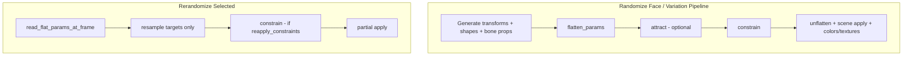
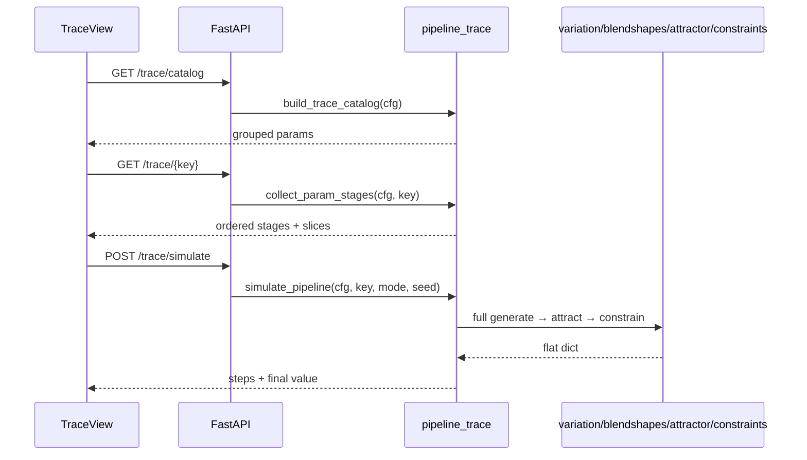

# Value Trace — Single-Parameter Pipeline Visualizer

## Problem

Today, understanding how e.g. `NoseBind.rotation.x` gets its final value requires hunting across `[chaos_joints.json](data/config/chaos_joints.json)`, `[attractor.json](data/config/attractor.json)`, `[constraints.json](data/config/constraints.json)`, blendshapes.json, and `[rerandomize.json](data/config/rerandomize.json)` with no unified execution view. The existing sidebar menus stay valuable for bulk editing; this adds a **parameter-centric lens** on top.

## Unified execution model

All three Blender randomization operators share one flat `dict[str, float]` space. They differ only at the **source** and **which stages run**:




**v1 scope (confirmed):** flat params only — joint axes, blendshape weights, bone custom properties. Material colors and texture channels are **phase 2** (separate post-constrain apply path in `[scene/materials.py](synth_head/scene/materials.py)` / `[scene/texture_swap.py](synth_head/scene/texture_swap.py)`).

---

## Architecture

### 1. Core trace module (new, testable)

Add `[synth_head/core/pipeline_trace.py](synth_head/core/pipeline_trace.py)` — pure Python, no bpy.

**Responsibilities:**


| Function                                               | Purpose                                                                                                                                                           |
| ------------------------------------------------------ | ----------------------------------------------------------------------------------------------------------------------------------------------------------------- |
| `build_trace_catalog(cfg)`                             | All traceable keys from existing `[build_param_registry](synth_head/core/rerandomize.py)` + metadata (kind, feature group for variation shapes, symmetry partner) |
| `rule_references_param(rule, key)`                     | True if param appears as target, source, condition, driver, or member of `params[]`                                                                               |
| `collect_param_stages(cfg, key)`                       | Ordered stage list with **filtered config slices** for the selected param                                                                                         |
| `simulate_pipeline(cfg, key, mode, seed, input_flat?)` | Run full pipeline math; return per-step value for `key`                                                                                                           |


**Stage order returned by `collect_param_stages`:**

1. **Generation** — source file depends on kind:
  - `joint` → `[chaos_joints.json](data/config/chaos_joints.json)`: globals (`transform_max`, `rotate_max`, `scale_max`, `enable_scale`) + matching `overrides` entries + symmetry note for L/R pairs
  - `blendshape` (variation) → `[blendshapes.json](data/config/blendshapes.json)`: feature group, `max_var_shapes`, `max_variation`, per-shape `variation_overrides`
  - `blendshape` (expression) → expression pair/center context + `expression_max` / `expression_overrides`
  - `blendshape` (independent) → `independent_shapes[key]` block
  - `bone_property` → `bone_properties[key]` block
2. **Attractor** → `[attractor.json](data/config/attractor.json)`: `enabled`, `max_influence`, `distance_weights[key]`, excluded status; note that colors are phase 2
3. **Constraints** → `[constraints.json](data/config/constraints.json)`:
  - `hard_clamps[key]` if present
  - relational rules where `rule_references_param(rule, key)` — **preserving JSON order** (same order as `[apply_relational_rules](synth_head/core/constraints.py)`)
4. **Rerandomize (alternate path)** → `[rerandomize.json](data/config/rerandomize.json)`: whether key is a target, `reapply_constraints`, sampling range via existing `[param_range](synth_head/core/rerandomize.py)`

**Simulation (`simulate_pipeline`) — accuracy strategy:**

Simulation must run the **full flat dict**, not isolated per-param math, because constraints and attractor are cross-param. Implementation:

```python
# Pseudocode — reuses existing generators unchanged
rng = Random(seed)
transforms = generate_single_frame_transforms(...)
bs = generate_single_frame_blendshape_weights(...)
props = generate_bone_property_values(...)
flat = flatten_params(transforms, {**bs, **props})

steps = [{"stage": "generate", "value": flat[key]}]

if mode == "randomize_face":
    pool = PoolCache(); pool.sync(resolved_attractor_dir, joint_names, ...)
    flat_before = flat.copy()
    flat, colors, dbg = attract(flat, pool, cfg.attractor, ...)
    steps.append({"stage": "attract", "value": flat[key], "delta": flat[key] - flat_before[key]})

flat_before = flat.copy()
flat = constrain(flat, cfg.constraints)
steps.append({"stage": "constrain", "value": flat[key], "delta": flat[key] - flat_before[key]})

return {"final": flat[key], "steps": steps, "peer_effects": [...]}
```

Each step in `steps` includes: `stage_id`, `label`, `value` (absolute after step), `delta` (change from previous step), `skipped` (bool — e.g. attractor disabled), `detail` (optional one-liner, e.g. "excluded from attractor").

For **constraints**, v1 returns one aggregate step; the API shape reserves `substeps[]` for per-rule values (phase 2) so the ribbon can grow without breaking.

For `**rerandomize**` mode: start from `input_flat` (default: mid-range or user-supplied snapshot), call `[rerandomize_flat](synth_head/core/rerandomize.py)` with resolved targets containing only `key` (+ peer keys from `winner_take_all` via existing `[expand_constraint_peers](synth_head/core/rerandomize.py)`). Steps: `read` → `resample` → `constrain` (if enabled) — each with `value` + `delta`.

Pool loading for attractor uses existing `[PoolCache.sync](synth_head/core/attractor.py)` with paths resolved from profile `runner.json` + `attractor.json` (same as Blender).

Add pytest coverage in `[synth_head/tests/test_pipeline_trace.py](synth_head/tests/test_pipeline_trace.py)` mirroring patterns in `[test_rerandomize.py](synth_head/tests/test_rerandomize.py)` and `[test_attractor.py](synth_head/tests/test_attractor.py)`.

---

### 2. Server API (new endpoints)

Add `[config_ui/server/trace.py](config_ui/server/trace.py)`, wired in `[config_ui/server/app.py](config_ui/server/app.py)`:


| Endpoint                                     | Returns                                                                                                                    |
| -------------------------------------------- | -------------------------------------------------------------------------------------------------------------------------- |
| `GET /api/profiles/{name}/trace/catalog`     | Grouped param list: joints, variation shapes, expression shapes, independent shapes, bone properties — searchable metadata |
| `GET /api/profiles/{name}/trace/{param_key}` | `collect_param_stages` output + param metadata                                                                             |
| `POST /api/profiles/{name}/trace/simulate`   | Body: `{ param_key, mode, seed, input_flat?, config_overrides? }` → simulation result                                      |


Config loading: reuse `[load_config(profile_path, project_root=...)](synth_head/core/config.py)` from `[profiles.validate_profile](config_ui/server/profiles.py)`. Optional `config_overrides` merges unsaved UI edits before simulate (keyed by file id, e.g. `{ "constraints": {...} }`).

Extend existing `[build_registry](config_ui/server/manifests.py)` or replace catalog endpoint's joint list with `build_param_registry` for consistency with rerandomize picker.

---

### 3. Frontend — new workspace mode (existing menus untouched)

Modify `[config_ui/web/static/index.html](config_ui/web/static/index.html)` and `[config_ui/web/static/assets/app.js](config_ui/web/static/assets/app.js)`.

**UX principle: summary first, depth on demand.** Even one param touches 4 config files and dozens of fields. The UI must feel slick and scannable — not a wall of JSON.

#### Layout

```
┌──────────────────────────────────────────────────────────────┐
│ Top bar (profiles, validate, save) — unchanged               │
├──────────────┬───────────────────────────────────────────────┤
│ Mode toggle  │  STICKY: Pipeline ribbon (values after steps) │
│ Config | Trace│  [Generate 0.42] → [Attract 0.38] → [Final] │
├──────────────┼───────────────────────────────────────────────┤
│ Param picker │  Stage cards (collapsed by default)           │
│ (search)     │  Expand → config fields + inline edit         │
└──────────────┴───────────────────────────────────────────────┘
```

- **Config Files mode:** identical to today
- **Value Trace mode:** param picker sidebar + trace main panel

#### UX patterns (required in v1)

| Pattern | Implementation |
|---|---|
| **Sticky pipeline ribbon** | Horizontal stepper across top of main panel. Each node shows stage name + **large mono value** after simulate. Arrows between nodes. Skipped stages (attractor off) shown dimmed with "skipped" badge, not hidden. |
| **Values on stage cards** | After simulate, each matching stage card header gets the same value badge + Δ chip (green ↓ / red ↑ / neutral —). Card and ribbon stay in sync. |
| **Progressive disclosure** | Stage cards **collapsed by default** — title, config file badge, value badge only. One click expands config fields. Constraints stage: collapsed shows rule count; expand lists individual rules. |
| **Hide irrelevant noise** | Stages with zero config for this param show as compact "no config" row (not a full card). Relational rules that only *read* the param (condition/driver) grouped under "Referenced by" sub-section, separate from rules that *write* it. |
| **Param picker** | Search-as-you-type, keyboard ↑↓ + Enter. Group headers (Joints, Variation shapes, …) sticky. Recent params (localStorage, last 5). Kind + feature-group subtitle on each row. |
| **Simulate controls** | Compact bar below ribbon: seed, mode tab, **Simulate** button. Re-run on seed change (debounced). Subtle pulse animation on value badges when results update. |
| **Final value hero** | Last ribbon node + bottom summary both show final value prominently — impossible to miss. |
| **Empty / loading states** | No param selected → illustration + "Pick a parameter". Simulating → skeleton shimmer on ribbon nodes. |
| **Density toggle** | "Compact" (default) vs "Show all fields" — compact hides global defaults that don't override this param. |

Match existing aesthetic from `[style.css](config_ui/web/static/assets/style.css)`: dark glass panels, `--accent` purple, JetBrains Mono for values, DM Sans for labels.

#### New modules

| File | Role |
|---|---|
| `[param-picker.js](config_ui/web/static/assets/param-picker.js)` | Search/filter/group picker; recent history |
| `[trace-view.js](config_ui/web/static/assets/trace-view.js)` | Ribbon, stage cards, simulate integration, staging |
| `[trace-ribbon.js](config_ui/web/static/assets/trace-ribbon.js)` | Sticky pipeline stepper — reusable, driven by `steps[]` from simulate API |

#### Trace view sections (top to bottom)

1. **Header** — param key (mono), kind badge, symmetry partner link
2. **Pipeline ribbon** — always visible; populated after first simulate; shows **value after each step** as the primary visual anchor
3. **Simulate bar** — seed, mode tabs (`Randomize Face` \| `Rerandomize Selected`), Simulate button
4. **Stage cards** — numbered, collapsed by default; header shows value badge when simulated
5. **Save** — top-bar Save writes all dirty staged config files

**Simulate result example (ribbon + cards share this data):**

```
Generate ──→ Attract ──→ Constrain ──→ Final
  0.42        0.38 Δ-0.04   0.35 Δ-0.03   0.35
```

Stage card headers mirror the same numbers so users never hunt for "what happened here."

#### Widget reuse (minimal extraction)

- Single-field range editors from `[joint-override-editor.js](config_ui/web/static/assets/joint-override-editor.js)` — extract a `mountRangeField(min, max, onChange)` helper
- Single-rule card from `[relational-rules-editor.js](config_ui/web/static/assets/relational-rules-editor.js)` — export `mountRuleCard(rule, index, onChange)` for filtered rule display
- Hard clamp row from existing constraints form path in `[forms.js](config_ui/web/static/assets/forms.js)`

Styles in `[style.css](config_ui/web/static/assets/style.css)`: `.trace-ribbon`, `.trace-step-value`, `.trace-delta-up/down`, `.trace-stage-card` (collapsed/expanded), `.trace-value-badge`, param picker list, simulate shimmer — extend existing CSS variables, no new design system.

---

## Data flow




---

## Key design decisions

- **Per-step values are first-class UI** — ribbon + stage card headers always show the simulated value after each step; not buried in a table at the bottom
- **Progressive disclosure by default** — collapsed cards, compact mode, irrelevant stages minimized
- **Accuracy over isolation:** simulation runs the complete flat pipeline with a fixed seed
- **Unsaved edits:** simulate accepts `config_overrides` so users can test before Save
- **Variation shape lottery:** generation stage note + simulate reflects actual lottery for that seed
- **Canonical keys:** L/R pairs use Left-side config; Right keys show mirrored simulate output
- **No changes to existing config menus** — trace mode is additive

---

## 4. Cursor rule — keep visualizer in sync with execution

Add [`.cursor/rules/pipeline-trace-sync.mdc`](.cursor/rules/pipeline-trace-sync.mdc) so any future pipeline change is checked against the Value Trace visualizer.

**Scope:** file-specific (not `alwaysApply`) — triggers when editing pipeline execution code or trace layer:

```yaml
globs: synth_head/core/{variation,blendshapes,constraints,attractor,rerandomize,pipeline_trace}.py,synth_head/operators.py,config_ui/server/trace.py,config_ui/web/static/assets/trace-view.js
alwaysApply: false
```

**Rule content (concise, actionable):**

1. **Canonical execution order** — document the two paths the visualizer must reflect:
   - **Randomize Face / Variation Pipeline:** generate → flatten → attract (optional) → constrain → unflatten/apply
   - **Rerandomize Selected:** read flat → resample targets → constrain (if `reapply_constraints`) → partial apply — **no attractor**

2. **Single source of truth for stage metadata:** [`synth_head/core/pipeline_trace.py`](synth_head/core/pipeline_trace.py) owns `collect_param_stages()` and `simulate_pipeline()`. The trace UI and server API must **delegate** to this module — never duplicate stage order or simulation logic in JS.

3. **When changing execution** (adding/removing/reordering a stage, new config file affecting flat params, new rule type, new generation path):
   - Update `pipeline_trace.py` stage list and simulate path to match
   - Update [`test_pipeline_trace.py`](synth_head/tests/test_pipeline_trace.py) with at least one param affected by the change
   - If a new config file or key space is introduced, add it to `collect_param_stages()` for affected params
   - Spot-check in Config UI Value Trace: pick one affected param, confirm stage cards and simulate output match Blender Randomize Face

4. **When changing config schema only** (new JSON key in an existing file, no execution change): update `collect_param_stages()` filtered slices if the key appears in a trace stage; no simulate changes needed.

5. **Do not drift:** If `operators.py` randomization loop and `pipeline_trace.simulate_pipeline()` disagree, **`pipeline_trace.py` is wrong** until fixed — the visualizer's whole purpose is accurate reflection of runtime.

This mirrors the pattern of existing rules like [`driver-architecture.mdc`](.cursor/rules/driver-architecture.mdc) — a focused, check-first doc that prevents silent parity gaps.

---

## Phase 2 (out of v1 scope)

- Material color params (skin/hair/lip) as separate trace kind with stages in `[materials.json](data/config/materials.json)` + attractor color blend
- Texture channel params in `[texture_swap.json](data/config/texture_swap.json)`
- Deep-link from trace stage → scroll to exact field in existing config form
- **Per-rule constraint substeps** in simulate ribbon (`substeps[]` per relational rule — value after each rule fires)
- Expand simulate to material/texture stages

---

## Files to create/modify

**Create:**

- `[synth_head/core/pipeline_trace.py](synth_head/core/pipeline_trace.py)`
- `[synth_head/tests/test_pipeline_trace.py](synth_head/tests/test_pipeline_trace.py)`
- `[config_ui/server/trace.py](config_ui/server/trace.py)`
- `[config_ui/web/static/assets/param-picker.js](config_ui/web/static/assets/param-picker.js)`
- `[config_ui/web/static/assets/trace-view.js](config_ui/web/static/assets/trace-view.js)`
- `[config_ui/web/static/assets/trace-ribbon.js](config_ui/web/static/assets/trace-ribbon.js)` — sticky per-step value stepper
- `[.cursor/rules/pipeline-trace-sync.mdc](.cursor/rules/pipeline-trace-sync.mdc)` — execution/visualizer parity checklist

**Modify:**

- `[synth_head/core/__init__.py](synth_head/core/__init__.py)` — export if needed
- `[config_ui/server/app.py](config_ui/server/app.py)` — register trace routes
- `[config_ui/web/static/index.html](config_ui/web/static/index.html)` — mode toggle, second sidebar slot
- `[config_ui/web/static/assets/app.js](config_ui/web/static/assets/app.js)` — mode switching, multi-file dirty/save for trace staging
- `[config_ui/web/static/assets/style.css](config_ui/web/static/assets/style.css)` — trace UI styles
- Minor exports in `[joint-override-editor.js](config_ui/web/static/assets/joint-override-editor.js)` and `[relational-rules-editor.js](config_ui/web/static/assets/relational-rules-editor.js)` for reusable field widgets

**Not modified:** `[schema.py](config_ui/server/schema.py)` CONFIG_FILES list, `[forms.js](config_ui/web/static/assets/forms.js)` file layouts, any locked include lists